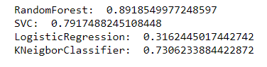
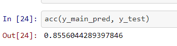

# VerzeoMajorProject
<h1>Introduction</h1>
This is Major Project for the internship Program from Verzeo. We have the group of 5 members and we have divided the work to complete the projet within desired time. The project 
includes the concepts of :-
<ul>
<li> Data visualization</li>
<li> Data pre-processing</li>
<li> Feature selection</li>
<li> Model Training </li>
<li> Ensembling Algorithm</li>
</ul>
The model has been developed to check whether the requirements or basic neccessties a person wants while buying house is been given at a metropolitan city. Also, the graphs developed 
to visualize data, shows which city among the metropolitan cities have more outliers, i.e, city that asks more money than other cities for same amneties. 
 
Many other parts have been been studied in the project.
 
<h2>Dataset Used</h2>
For model development, we have 6 excel files for the 6 cities: Delhi, Mumbai, Bengaluru, Kolkata, Chennai, and Hyderabad. With thes I have used the concepts of pandas to develop
the main excel file to combine all these files and make new column to tell the city particular house (or row) belongs to.
 
for the dataset, can Check <a href="https://www.kaggle.com/ruchi798/housing-prices-in-metropolitan-areas-of-india">Here</a>.
<h1>Feature Selection</h1>
The feature selection helps us to reduce the compuataional cost without affecting much to our accuracy. We have removed columns, AC, Wifi, Microwave, Refrigerator, bed, Sofa, Dining Table.
 
<h1>Models Used</h1>
We have used 4 different models:
<ul>
  <li>Logistic Regression</li>
  <li>Random Forest</li>
  <li>KNN</li>
  <li>SVC</li>
</ul>
After the development, we have chosen 3 algortithms that were giving more accuracy than others, i.e, Random Forest, SVC and KNN.
<h3>Ensembling Part</h3>
In this, we have developed the algorithm to combine the results that we were getting from three algortihms.
<h4>Working of Ensemble Algorthim</h4>
Since, the model we have developed works on classification, therefore, we were suppose to use the mojorty voting from algo and give values accordingly.
 
<h1>Results</h1>

After Ensembing:

